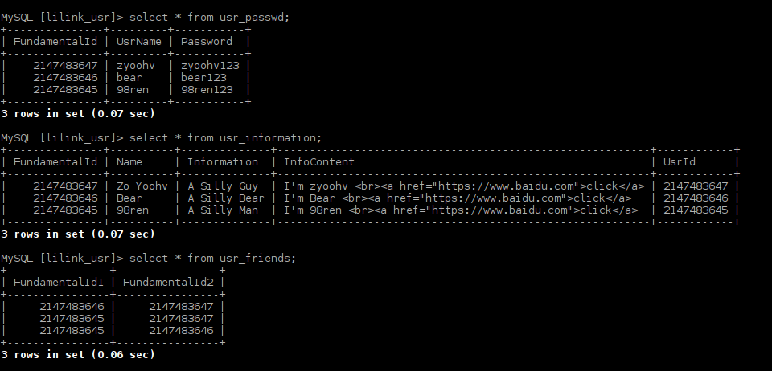

# User Information Example

## Database "lilink_usr" Tables

|Table Name|Function|
|:--------:|:------:|
|usr_passwd|fundamental id & usrname & password|
|usr_information|usr id & profile|
|usr_friends|linking information|

### Usr

*   table: usr_passwd

|FundamentalId|UsrName|Password|
|:-----------:|:-----:|:------:|
|0x7fffffff|zyoohv|zyoohv123|
|0x7ffffffe|bear|bear123|
|0x7ffffffd|98ren|98ren123|

*   table: usr_information

|FundamentalId|Name|Information|InfoContent|UsrId|
|:-----------:|:--:|:---------:|:---------:|:---:|
|0x7fffffff|Zo Yoohv|A Silly Guy|I'm zyoohv  <a href="https://www.baidu.com">click</a>|0x7fffffff|
|0x7ffffffe|bear|A Silly Bear|I'm bear  <a href="https://www.baidu.com">Baidu</a>|0x7ffffffe|
|0x7ffffffd|98_Ren|A Silly Man|I'm 98ren  <a href="https://www.baidu.com">98_Ren</a>|0x7ffffffd|

*   table: usr_friends

|FundamentalId1|FundamentalId2|
|:------------:|:------------:|
|0x7ffffffe|0x7fffffff|
|0x7ffffffd|0x7fffffff|
|0x7ffffffd|0x7ffffffe|

### DataBase Example Show

