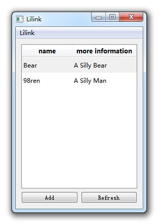
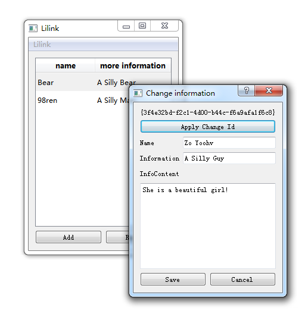
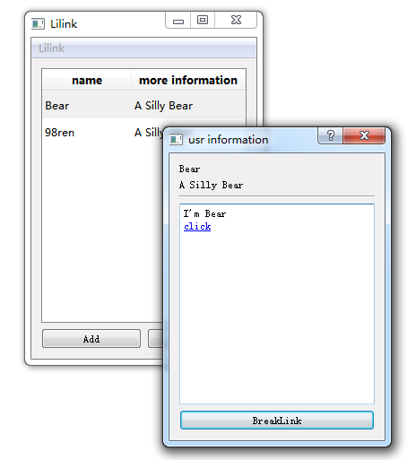
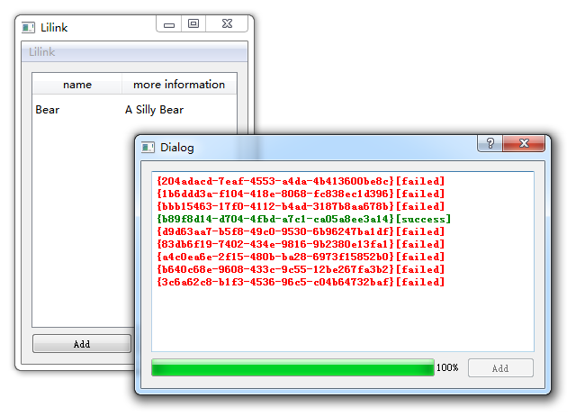

# What's lilink?

You are in trouble to distribute your phone number after you change one?

You can't make sure if your friends' information is out of date?

You can't make sure where are your firends working or learning now?

`lilink` will help you!

# How to use it?

I would like use it as a tool for some intimate friends.

But now it seems that can be used as a  more widely area.

For example

1.  I create a count named: zyoohv
2.  Than i finish my profile
3.  The system confirm my profile
4.  Set my setting, for example let people can not search me
5.  Add friends

Now, Every time i change my information, such as my telephone number, all my friends will change it by system. Of course i can get all my friends' information.

If you use smart phone, you can also import all your friends' phone number, qq number and so on.

# Design Philosophy

"More Easy, More Safe, More Powerful"

# What we Need now?

More information reference `wiki` please.

working log: [log.md](./log.md)
