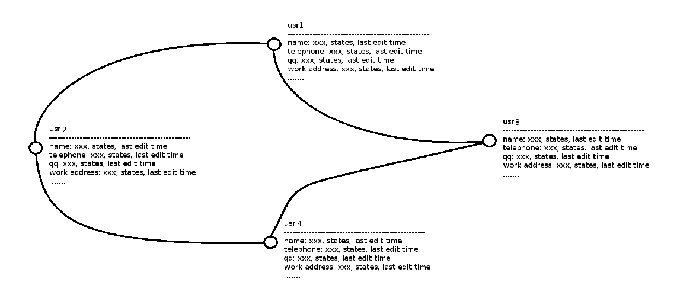

# What's lilink?

You are in trouble to distribute your phone number after you change one?

You can't make sure if your friends' information is out of date?

You can't make sure where are your firends working or learning now?

`lilink` will help you!

# Struct of lilink

# How to use it?

I would like use it as a tool for some intimate friends.

But now it seems that can be used as a  more widely area.

For example

1.  I create a count named: zyoohv
2.  Than i finish my profile
3.  The system confirm my profile
4.  Set my setting, for example let people can not search me
5.  Add friends

Now, Every time i change my information, such as my telephone number, all my friends will change it by system. Of course i can get all my friends' information.

If you use smart phone, you can also import all your friends' phone number, qq number and so on.

# Difficult

*  How to confirm information?

I suppose that maybe we can confirm usr's ID Card and real name.

*  How to let user like to update their new information?

If they want get the information of theirs friends, they will update themselves' information

*  Security problem.

Not sure.

# Others Problems

*   WAN or LAN?

WAN.

*   LAMP?

Maybe.

# What we Need now?

1.  Web page
2.  Manage user id, such as login or sign up.
3.  Maybe we also have trouble in set up `Lamp`.
